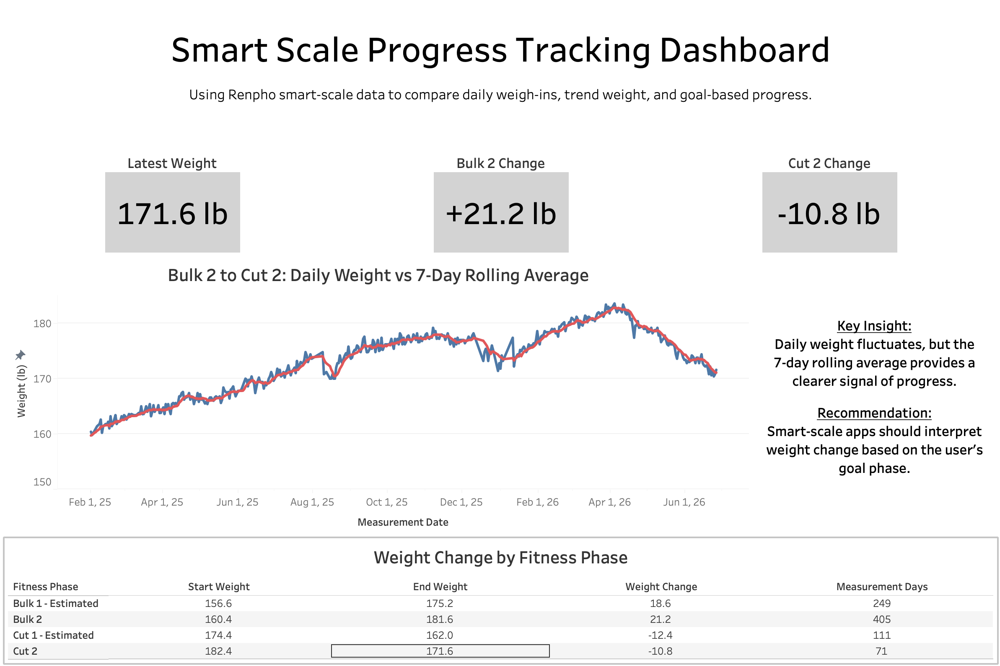

# Smart Scale Progress Tracking Dashboard

## Project Overview

This project uses personal Renpho smart-scale data as a case study to evaluate how a health-tech app could communicate progress more clearly. The analysis compares daily weight readings, rolling average trends, measurement consistency, metric reliability, and goal-based fitness phases.

The goal of the project is not just to analyze body weight, but to explore how smart-scale apps can help users better interpret progress through trend-based and goal-aware insights.

## Business Problem

Smart scales collect many biometric metrics, but users may misinterpret progress when apps emphasize isolated daily readings. Daily weight can fluctuate because of hydration, food intake, sodium, glycogen, recovery, and measurement timing.

This creates a product problem: users may become discouraged or confused even when their long-term progress is aligned with their goal.

## Key Questions

- How much does daily weight fluctuate compared to longer-term trends?
- Do rolling averages provide a clearer signal of progress?
- Which smart-scale metrics are complete and reliable enough to emphasize?
- Does weight change mean different things depending on whether the user is bulking or cutting?
- How could a smart-scale app improve progress communication?

## Tools Used

- PostgreSQL / DBeaver: data cleaning, validation, exploratory analysis
- Python / pandas / matplotlib: trend analysis, rolling averages, visualizations
- Tableau: dashboard design and communication
- GitHub: project documentation and version control

## Project Workflow

1. Imported raw Renpho smart-scale data into PostgreSQL.
2. Cleaned placeholder values and converted fields into usable numeric/date formats.
3. Validated row counts, missing values, and date ranges.
4. Performed SQL exploratory analysis on weight trends, daily fluctuations, weekly changes, rolling averages, measurement consistency, and metric reliability.
5. Labeled records by estimated fitness phases, including bulking and cutting periods.
6. Used Python to create daily trend tables, 7-day rolling averages, phase summaries, and exported analysis-ready files.
7. Built a Tableau dashboard to communicate the final insights.

## Key Insights

### 1. Daily weight is noisy

Daily weight readings fluctuated frequently across the tracking period. This shows why isolated weigh-ins can be misleading if shown without trend context.

### 2. Rolling averages provide clearer progress signals

The 7-day rolling average smoothed daily fluctuations and made it easier to understand whether weight was generally increasing or decreasing over time.

### 3. Goal context changes the meaning of weight change

During bulking phases, weight gain represented goal-aligned progress. During cutting phases, weight loss represented goal-aligned progress. This shows that weight changes should not be interpreted as universally good or bad.

### 4. Metric reliability matters

Weight was the most complete and reliable metric in the dataset. Body composition metrics were useful for context but should be interpreted carefully because smart-scale estimates can be sensitive to measurement conditions.

## Product Recommendations

- Prioritize trend weight or rolling average weight instead of single-day weight.
- Allow users to define goal phases such as bulking, cutting, or maintenance.
- Interpret weight changes relative to the user’s current goal.
- Show confidence or context when measurement gaps reduce trend reliability.
- Present body composition metrics as estimates rather than exact progress indicators.

## Dashboard

## Final Takeaway

This project shows that smart-scale apps can improve user experience by shifting from isolated daily measurements to trend-based and goal-aware progress insights. By combining rolling averages, phase context, and metric reliability, health-tech products can help users better understand whether their progress is truly aligned with their goals.
